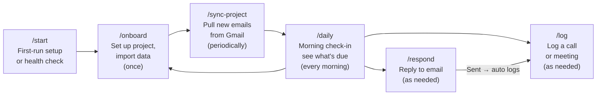

# ops-brain

A Claude Code plugin for project managers handling multiple projects. Provides 5 skills for daily briefings, conversation logging, email responses, Gmail sync, and project onboarding — all backed by an Obsidian vault as your second brain.

## Installation

### Global (available in all projects)

```bash
claude plugin marketplace add github:EricTechPro/ops-brain
claude plugin install ops-brain
```

### Project-scoped (available only in this project)

```bash
claude plugin marketplace add github:EricTechPro/ops-brain
claude plugin install ops-brain --scope project
```

Project scope is recommended when the plugin lives inside your vault — it keeps the skills tied to the project they belong to and avoids polluting other workspaces.

---

## Skills

| Skill | Command | What it does |
|-------|---------|-------------|
| Start | `/start` | Pre-check dependencies (Obsidian, plugins), then first-run setup or health check |
| Onboard | `/onboard` | Sets up new or existing projects — imports from Gmail, files, or pasted text |
| Sync Project | `/sync-project` | Fetches emails from a Gmail label, dedupes, threads, routes attachments |
| Daily | `/daily` | Morning briefing — scans all projects for pending tasks, recent activity, and inbox status |
| Respond | `/respond` | Crafts an email as copyable HTML, opens in browser, logs after sending, deletes file |
| Log | `/log` | Adds a timestamped entry to a project's conversation log and extracts action items |

---

## How the Workflow Works



### Quick Reference

| When | Run | How often |
|------|-----|-----------|
| New project or importing data | `/onboard` | Once per project |
| New emails to pull in | `/sync-project` | Periodically |
| Start of day | `/daily` | Every morning |
| Need to reply to someone | `/respond` | As needed |
| After a call, meeting, or event | `/log` | As needed |

---

## Required Vault Structure

```
your-vault/
├── inbox/                  ← Unprocessed dumps (PDFs, text, CSVs, screenshots)
├── daily/                  ← Dated notes and briefings
├── projects/
│   └── [project-name]/
│       ├── overview.md            ← Project + client profile, contacts
│       ├── conversation-log.md    ← Source of truth — all interactions
│       ├── links.md               ← Categorized URL library
│       ├── constants/             ← Contracts, agreements, invoices
│       ├── responses/             ← Temporary email drafts (auto-deleted)
│       └── shared/
│           └── deliverables/      ← Quotes, proposals, work product
├── templates/              ← Reusable note templates
├── archives/               ← Completed projects
├── scripts/                ← gmail_sync.py for Gmail integration
└── team.md                 ← Global handle → name → role lookup
```

## Gmail Integration

Gmail sync powers `/sync-project` and `/onboard`. The sync script (`scripts/gmail_sync.py`) is deployed automatically when you run `/start`. You just need to set up the Google Cloud credentials once.

### Gmail API Setup (one-time, ~5 minutes)

#### 1. Create a Google Cloud project

1. Go to [console.cloud.google.com](https://console.cloud.google.com/)
2. Click the project dropdown (top-left, next to "Google Cloud")
3. Click **New Project**
4. Name it anything (e.g. "Ops Brain") → **Create**
5. Make sure your new project is selected in the dropdown

#### 2. Enable the Gmail API

1. In the search bar at the top, type **Gmail API**
2. Click **Gmail API** in the results
3. Click **Enable**

#### 3. Configure the OAuth consent screen

1. Go to **APIs & Services → OAuth consent screen** (left sidebar)
2. Select **External** → **Create**
3. Fill in only the required fields:
   - App name: `Ops Brain`
   - User support email: your email
   - Developer contact email: your email
4. Click **Save and Continue** through the remaining steps (no scopes or test users needed)
5. On the summary page, click **Back to Dashboard**

#### 4. Create OAuth credentials

1. Go to **APIs & Services → Credentials** (left sidebar)
2. Click **+ Create Credentials → OAuth client ID**
3. Application type: **Desktop app**
4. Name: `Ops Brain` (or anything)
5. Click **Create**
6. Click **Download JSON** on the confirmation dialog
7. Save the downloaded file to your vault:
   ```
   scripts/.gmail-credentials/credentials.json
   ```

#### 5. Configure your environment

Create `scripts/.env` in your vault (or copy from `scripts/.env.example`):

```env
GMAIL_USER_EMAIL=you@yourdomain.com
GMAIL_CREDENTIALS_FILE=scripts/.gmail-credentials/credentials.json
GMAIL_TOKEN_FILE=scripts/.gmail-credentials/token.json
GMAIL_DOWNLOAD_DIR=/tmp/gmail-sync
```

#### 6. Install Python dependencies

```bash
pip3 install -r scripts/requirements.txt
```

#### 7. Authenticate (opens browser once)

```bash
python3 scripts/gmail_sync.py label "INBOX" --max-results 1
```

Your browser opens → sign in with your Google account → click **Allow**. A `token.json` is saved automatically. You won't need to do this again unless the token expires.

#### 8. Set up Gmail labels for your projects

In Gmail:
1. Go to **Settings** (gear icon) → **See all settings** → **Labels** tab
2. Click **Create new label** for each project:
   ```
   Projects/Acme Corp
   Projects/Big Client
   Projects/Side Gig
   ```
3. Create filters to auto-label incoming mail (Settings → **Filters and Blocked Addresses** → **Create a new filter**)

When you `/onboard` a project, reference the label name to pull all emails into your vault automatically.

> **Security:** `scripts/.env`, `scripts/.gmail-credentials/`, and `scripts/__pycache__/` are in `.gitignore` — credentials never leave your machine.

## File Locations

```
.claude/skills/ops-brain/
├── README.md
├── skills/
│   ├── start/SKILL.md
│   ├── daily/SKILL.md
│   ├── log/SKILL.md
│   ├── onboard/SKILL.md
│   ├── respond/SKILL.md
│   └── sync-project/SKILL.md
└── shared/
    ├── project-picker.md
    ├── read-project-context.md
    ├── log-and-extract.md
    └── route-files.md
```

## License

MIT
