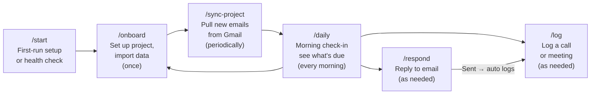

# ops-brain

A Claude Code plugin for project managers handling multiple projects. Provides 5 skills for daily briefings, conversation logging, email responses, Gmail sync, and project onboarding — all backed by an Obsidian vault as your second brain.

## Installation

### Global (available in all projects)

```bash
claude plugin marketplace add github:EricTechPro/ops-brain
claude plugin install ops-brain
```

### Project-scoped (available only in this project)

```bash
claude plugin marketplace add github:EricTechPro/ops-brain
claude plugin install ops-brain --scope project
```

Project scope is recommended when the plugin lives inside your vault — it keeps the skills tied to the project they belong to and avoids polluting other workspaces.

---

## Skills

| Skill | Command | What it does |
|-------|---------|-------------|
| Start | `/start` | Pre-check dependencies (Obsidian, plugins), then first-run setup or health check |
| Onboard | `/onboard` | Sets up new or existing projects — imports from Gmail, files, or pasted text |
| Sync Project | `/sync-project` | Fetches emails from a Gmail label, dedupes, threads, routes attachments |
| Daily | `/daily` | Morning briefing — scans all projects for pending tasks, recent activity, and inbox status |
| Respond | `/respond` | Crafts an email as copyable HTML, opens in browser, logs after sending, deletes file |
| Log | `/log` | Adds a timestamped entry to a project's conversation log and extracts action items |

---

## How the Workflow Works



### Quick Reference

| When | Run | How often |
|------|-----|-----------|
| New project or importing data | `/onboard` | Once per project |
| New emails to pull in | `/sync-project` | Periodically |
| Start of day | `/daily` | Every morning |
| Need to reply to someone | `/respond` | As needed |
| After a call, meeting, or event | `/log` | As needed |

---

## Required Vault Structure

```
your-vault/
├── inbox/                  ← Unprocessed dumps (PDFs, text, CSVs, screenshots)
├── daily/                  ← Dated notes and briefings
├── projects/
│   └── [project-name]/
│       ├── overview.md            ← Project + client profile, contacts
│       ├── conversation-log.md    ← Source of truth — all interactions
│       ├── links.md               ← Categorized URL library
│       ├── constants/             ← Contracts, agreements, invoices
│       ├── responses/             ← Temporary email drafts (auto-deleted)
│       └── shared/
│           └── deliverables/      ← Quotes, proposals, work product
├── templates/              ← Reusable note templates
├── archives/               ← Completed projects
├── scripts/                ← gmail_sync.py for Gmail integration
└── team.md                 ← Global handle → name → role lookup
```

## Gmail Integration

Requires `scripts/gmail_sync.py` with OAuth2 (read-only access). Used by `/sync-project` and `/onboard` for email import.

## File Locations

```
.claude/skills/ops-brain/
├── README.md
├── skills/
│   ├── start/SKILL.md
│   ├── daily/SKILL.md
│   ├── log/SKILL.md
│   ├── onboard/SKILL.md
│   ├── respond/SKILL.md
│   └── sync-project/SKILL.md
└── shared/
    ├── project-picker.md
    ├── read-project-context.md
    ├── log-and-extract.md
    └── route-files.md
```

## License

MIT
